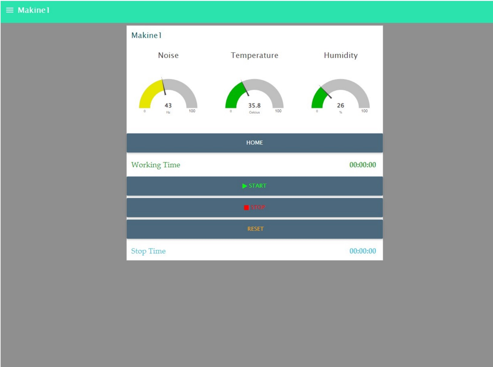
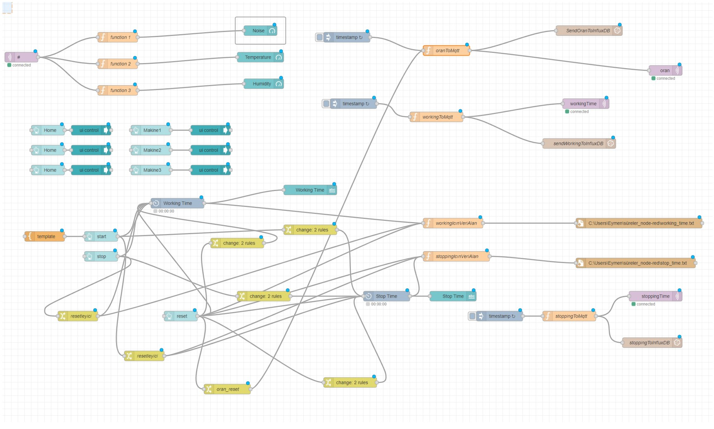
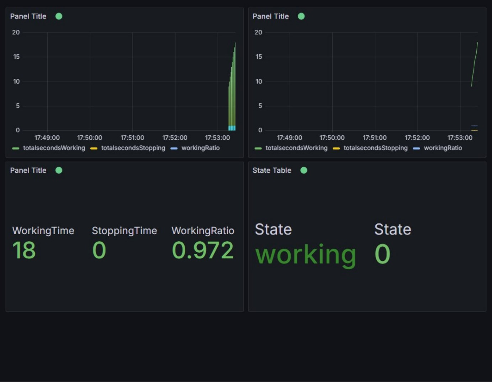

# Real-Time Production Monitoring with Node-RED, MQTT, and Grafana

This project is designed to monitor real-time data from production devices, process this data using Node-RED, and visualize the results on Grafana dashboards. 

## Technologies Used

- Node-RED
- MQTT
- Grafana

## Node-RED Dashboard

Here is the real-time dashboard created in Node-RED:

## Node-RED Flow

The flow structure of the application:

## Grafana Visualization

This is how the production data is visualized on the Grafana dashboard:

## Full Report

For more details about the project setup and flow configurations, check out the full report:

[Download Full Report](./docs/Staj_IQV.pdf)
